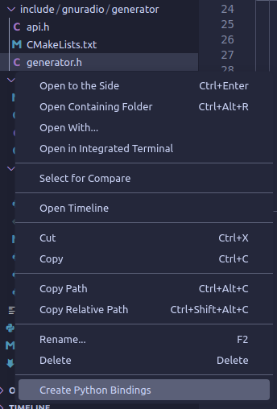

# GNURadio Integration

An extension to help you with work with [GNURadio](https://www.gnuradio.org) in VSCode.

Features:
- Opening and compiling GRC Flowgraph files (`.grc`)
- Manipulating the OOT module with `gr_modtool`

## Commands
- **GNURadio Companion:**;
    - **Open the application**;
    - **Edit Flowgraph** - edit the selected GRC flowgraph file in GNURadio Companion application;
- **GNURadio Compiler**:
    - **Compile Flowgraph** ⚠ - compile the selected GRC flowgraph file;
    - **Compile and Run Flowgraph** ⚠ - compile and run the selected GRC flowgraph file.
- **GNURadio Module**:
    - **Create OOT Module**;
    - **Create Block**;
    - **Create Python Bindings** ⚠️ 🪣 - generate pybind11 code based on the block's C++ header;
    - **Rename Block**;
    - **Remove Blocks** 🪣;
    - **Convert XML to YAML** ⚠ - convert old XML block definitions to YAML.

**Warning!** Commands marked with ⚠ will overwite target files without confirmation!

## Command palette

**WIP**: Commands marked with 🪣 can use regular expressions to process multiple blocks at once. Picking the "Regular expression" option selects all blocks with names containing the fragment and any symbols before and after it (uses `.*{input}.*` when `{input}` is entered).

## Explorer context menu
| Flowgraph | C++ block header | XML block definition |
|-|-|-|
|  |  |  |

## Editor title bar
| Flowgraph |
|-|
|   | 

## Extension settings
- **GNURadio Companion command** (default: `gnuradio-companion`);
- **GNURadio CLI compiler command** (default: `grcc`);
- **Check for XML block definitions** on startup (default: disabled).
